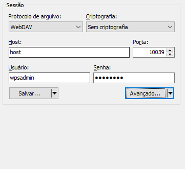
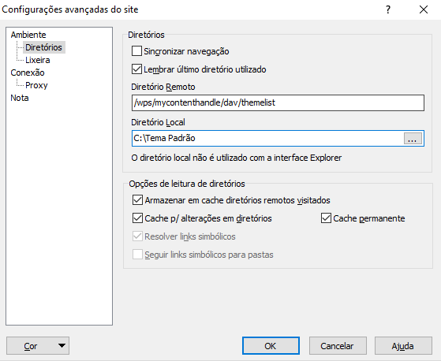

# Criação de tema customizado para o WebSphere Portal

Segundo a IBM, a melhor maneira de criar um tema customizado, é copiar o tema padrão do próprio WebSphere Portal, para que na criação do tema customizado, não seja esquecido de incluir as configurações necessárias.

> The best way to start creating your own custom theme is by copying the portal WebSphere® Portal theme. This ensures that your theme has all the required elements for the theme to function.

## 1. Cópia do tema padrão do WebSphere Portal

Para se fazer a cópia do tema padrão do WebSphere Portal precisaremos acessar o diretório onde se encontra o tema dentro de uma instância do WebSphere Portal. A leitura desse diretório se dá através do protocolo WebDAV (Web Distributed Authoring and Versioning) que é um protocolo de transferência de arquivos, semelhantemente ao protocolo FTP, com a vantagem de conter informações sobre a versão e o autor dos arquivos e mudanças.

Para acessar o diretório remoto e transfência dos arquivos do tema padrão do WebSphere Portal é preciso ter um cliente WebDAV.  Sugiro utilizar o WinSCP que é o programa mais conhecido, também muito utilizado para transferência de arquivos via protocolo FTP.

Abrir o WinSCP e configurar uma nova conexão definindo os seguintes parâmetros:

Campo | Descrição
---|---
Protocolo de arquivo | WebDAV
Criptografia | Sem criptografia (Dependendo de como está disponibilizado a instância)
Host | O endereço IP ou DNS da instância do WebSphere Portal
Porta | 10039
Usuário | O usuário que acessa a administração do WebSphere Portal
Senha | A senha do usuário que acessa a administração do WebSphere Portal

Campo | Descrição
---|---
Diretório remoto | /wps/mycontenthandler/dav/themelist
Diretório local | Diretório definido na máquina local onde os arquivos serão copiadas

Uma vez conectado será exibido todo o conteúdo do **Diretório remoto**, feito isso basta copiar o diretório `ibm.portal.85Theme` para a máquina local (no meu caso estou utilizando o WebSphere Portal 8.5, por isso do "85Theme", no seu caso pode ser outro) e renomear para o nome desejado para o seu tema. 
